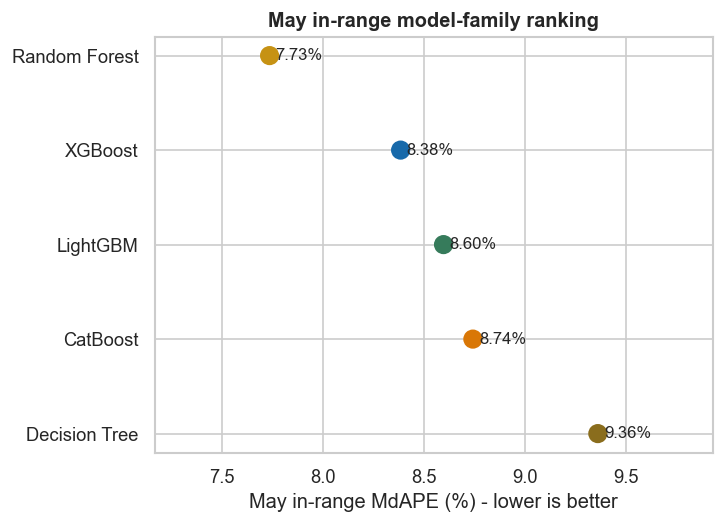
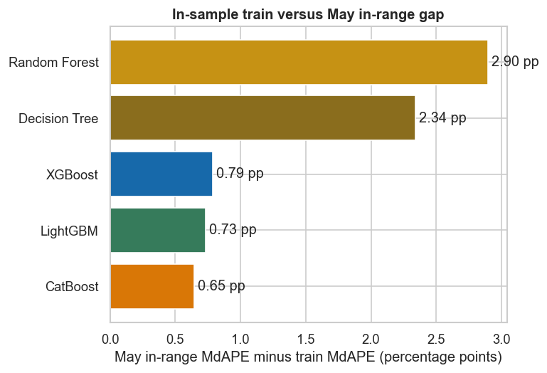
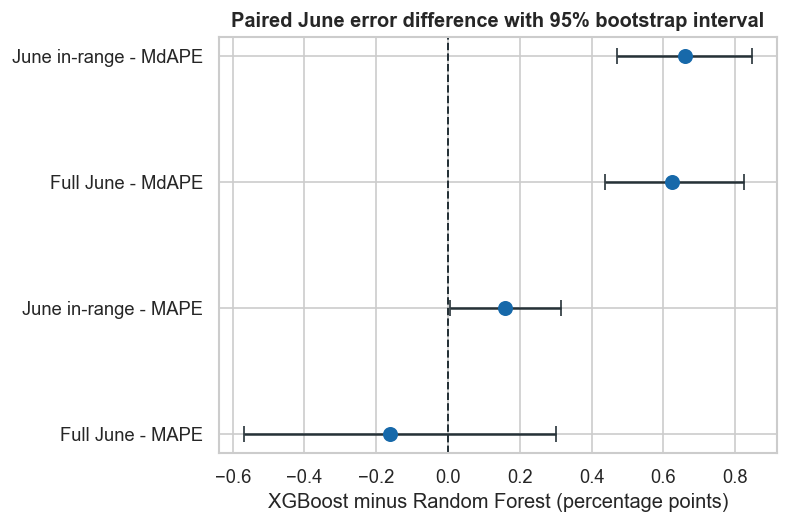
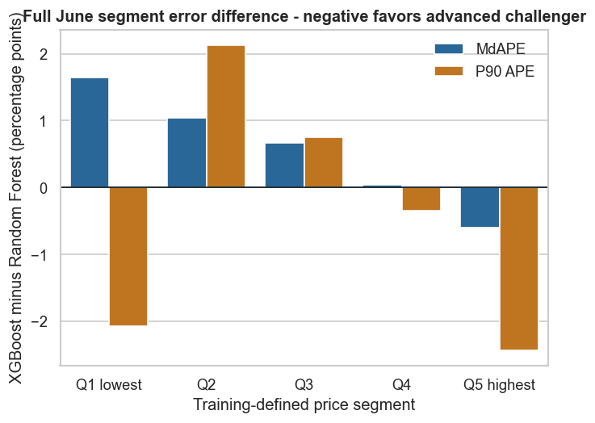
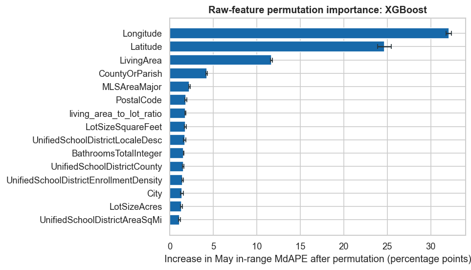

# Week 7 - Advanced Models: Final Report

## Executive Decision

**Select XGBoost as the final valuation model.** It explains materially more out-of-time price variation than Random Forest and has a much smaller apparent train-to-May error gap. Its median percentage error is moderately worse, so Random Forest should remain a shadow benchmark and percentage-error guardrail.

- **May in-range:** XGBoost R2 is `0.9082` versus `0.8888` for Random Forest.
- **Controlled tradeoff:** XGBoost adds only `0.17` percentage points of MAPE and `0.65` points of MdAPE.
- **Stability:** the train-to-May MdAPE gap falls from `2.90` points for Random Forest to `0.79` for XGBoost.

## Objective and Governance

The business objective is to improve retrospective `ClosePrice` estimates for California Residential SingleFamilyResidence transactions, supporting pricing review, listing strategy, and valuation triage.

- **Training:** February 2025-April 2026.
- **Model selection:** May 2026 observations inside training-derived price and price-per-square-foot limits.
- **Final test:** June 2026, opened only after the model and hyperparameters were locked.
- **Robustness:** Full May and Full June measure out-of-range behavior but do not drive model selection.

## What Week 7 Improves

1. Searches OLS, Ridge, Lasso, Decision Tree, Random Forest, XGBoost, LightGBM, and CatBoost under the same feature and time-split contract.
2. Uses shallow boosting trees, early stopping, row and feature subsampling, child-size controls, and L1/L2 regularization.
3. Removes missingness flags while retaining train-only frequency encoding for interpretable categorical inputs.
4. Replaces an MdAPE-only decision with an explicit May-only promotion rule balancing R2, percentage error, and generalization risk.

## Feature Contract

The models use 38 interpretable raw inputs covering property structure, amenities, location, school-district context, and retrospective seasonality.

- Numeric missing values are imputed and scaled using training parameters only.
- High-cardinality categories such as city, ZIP, county, MLS area, and school district are frequency encoded from training only.
- `_was_missing` and `flag_` artifacts are excluded from modeling.
- `price_per_sqft_audit` is used only for range auditing because it contains the target; it is never a predictor.

## May Model Selection

| Model | May R2 | May MAPE | May MdAPE | Train-to-May MdAPE gap |
|---|---:|---:|---:|---:|
| Random Forest | 0.8888 | 12.01% | **7.73%** | 2.90 pp |
| **XGBoost** | **0.9082** | 12.18% | 8.38% | 0.79 pp |
| LightGBM | 0.9044 | 12.38% | 8.60% | 0.73 pp |
| CatBoost | 0.9034 | 12.54% | 8.74% | **0.65 pp** |
| Decision Tree | 0.8286 | 14.36% | 9.36% | 2.34 pp |

- Random Forest has the lowest May MdAPE, but XGBoost's penalty is limited to `0.65` percentage points.
- XGBoost produces the strongest R2 among all evaluated families.
- LightGBM and CatBoost do not offer a better overall tradeoff than XGBoost.

## Generalization-Risk Diagnostic

- Random Forest's `2.90`-point gap is the largest among the competitive ensembles.
- XGBoost reduces the gap to `0.79` points while improving May R2.
- This is an apparent in-sample versus out-of-time gap, not a standalone proof of overfitting.

## Locked XGBoost Specification

- Feature set: `X5_full`
- Maximum depth: `6`
- Learning rate: `0.05`
- Effective estimators: `1,495`
- Row subsampling: `0.85`
- Feature subsampling: `0.85`
- Minimum child weight: `1`
- L1 regularization: `0`
- L2 regularization: `1`

XGBoost passes every May-only promotion guardrail: R2 gain of at least `0.01`, MAPE penalty no more than `0.25` points, MdAPE penalty no more than `1.00` point, and a smaller apparent generalization gap.

## June Test Evidence

| Population | Model | R2 | MAE | RMSE | MAPE | MdAPE |
|---|---|---:|---:|---:|---:|---:|
| June in-range | **XGBoost** | **0.9110** | **$154,492** | **$284,502** | 12.17% | 8.46% |
| June in-range | Random Forest | 0.8912 | $160,592 | $314,448 | **12.01%** | **7.80%** |
| Full June | **XGBoost** | **0.6782** | **$208,249** | **$871,792** | **13.81%** | 8.67% |
| Full June | Random Forest | 0.6073 | $223,243 | $962,977 | 13.97% | **8.05%** |

- XGBoost preserves its R2 and dollar-error advantage on the untouched June test.
- Random Forest remains better for median percentage accuracy.
- Full June confirms that XGBoost is more robust on R2, MAE, RMSE, and MAPE outside the comparable range.

## Statistical Error Tradeoff

- Random Forest's June MdAPE advantage is statistically consistent in the paired bootstrap.
- June in-range MAPE also slightly favors Random Forest; Full-June MAPE is inconclusive.
- XGBoost is selected for overall valuation performance, not because it wins every error metric.

## Price-Segment Risk

- Random Forest has lower typical percentage error in Q1-Q4.
- XGBoost improves both typical and tail percentage error in the highest-price Q5 segment.
- Q1 tail cases and Q5 high-value homes require manual comparable-sale review regardless of model.

## Interpretable Drivers

- Longitude, latitude, and living area are the dominant predictive inputs.
- County, MLS area, ZIP, lot size, and school-district context provide additional local-market signal.
- Importance measures predictive dependence, not causal price effects; correlated location features may share importance.

## Assumptions and Limitations

- May is a single validation month, so selection-process overfitting remains possible after comparing many configurations.
- Frequency encoding measures category prevalence, not a category-specific price premium.
- Close-month seasonality and age at close are retrospective; deployment requires a clearly defined valuation date.
- Luxury, unusual price-per-square-foot, weak-location-match, and tail-risk properties remain outside fully automated pricing.
- XGBoost uses nearly the full estimator ceiling; future work should test a wider ceiling inside nested or rolling validation.

## Business Recommendation

Use **XGBoost as the primary valuation model** because it provides the best balance of variance explained, dollar-error control, temporal stability, and tail robustness. Keep **Random Forest as a monitoring benchmark** for median percentage error.

Operationally, the prediction should support rather than replace pricing judgment. Escalate Q1 tail cases, Q5 high-value homes, unusual price-per-square-foot records, and properties with weak geographic comparables for manual review.
